---
## Front matter
title: "Лабораторная работа №8"
subtitle: "Поиск файлов. Перенаправление ввода-вывода. Просмотр запущенных процессов"
author: "Гурылев Артем Андреевич"

## Generic otions
lang: ru-RU
toc-title: "Содержание"

## Bibliography
bibliography: bib/cite.bib
csl: pandoc/csl/gost-r-7-0-5-2008-numeric.csl

## Pdf output format
toc: true # Table of contents
toc-depth: 2
lof: true # List of figures
lot: true # List of tables
fontsize: 12pt
linestretch: 1.5
papersize: a4
documentclass: scrreprt
## I18n polyglossia
polyglossia-lang:
  name: russian
  options:
	- spelling=modern
	- babelshorthands=true
polyglossia-otherlangs:
  name: english
## I18n babel
babel-lang: russian
babel-otherlangs: english
## Fonts
mainfont: PT Serif
romanfont: PT Serif
sansfont: PT Sans
monofont: PT Mono
mainfontoptions: Ligatures=TeX
romanfontoptions: Ligatures=TeX
sansfontoptions: Ligatures=TeX,Scale=MatchLowercase
monofontoptions: Scale=MatchLowercase,Scale=0.9
## Biblatex
biblatex: true
biblio-style: "gost-numeric"
biblatexoptions:
  - parentracker=true
  - backend=biber
  - hyperref=auto
  - language=auto
  - autolang=other*
  - citestyle=gost-numeric
## Pandoc-crossref LaTeX customization
figureTitle: "Рис."
tableTitle: "Таблица"
listingTitle: "Листинг"
lofTitle: "Список иллюстраций"
lotTitle: "Список таблиц"
lolTitle: "Листинги"
## Misc options
indent: true
header-includes:
  - \usepackage{indentfirst}
  - \usepackage{float} # keep figures where there are in the text
  - \floatplacement{figure}{H} # keep figures where there are in the text
---

# Цель работы

Целью работы является ознакомление с инструментами поиска файлов и фильтрации текстовых данных, а также приобретение практических навыков: по управлению процессами(и заданиями)и по проверке использования диска и обслуживанию файловых систем.

# Выполнение лабораторной работы

Для начала войдём в операционную систему и откроем командную строку.

Запишем в файл file.txt названия файлов, содержащихся в каталоге /etc(рис. [-@fig:001], [-@fig:003]), после чего допишем в этот же файл названия файлов, содержащихся в домашнем каталоге(рис. [-@fig:002], [-@fig:004]).

Выведем имена всех файлов из file.txt, с расширением .conf, после чего запишем их в новый текстовой файл conf.txt(рис. [-@fig:002]). 

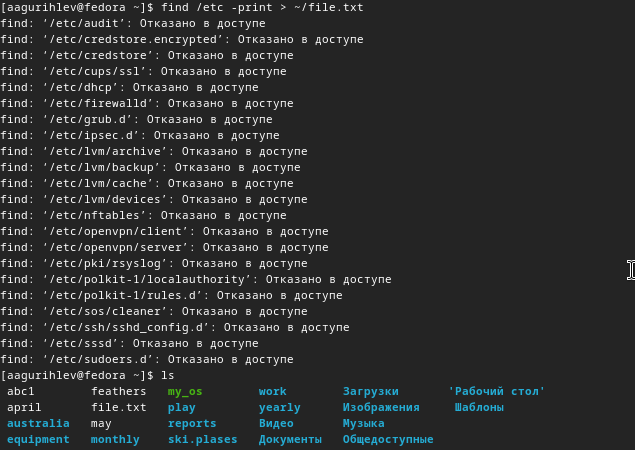{#fig:001 width=70%}

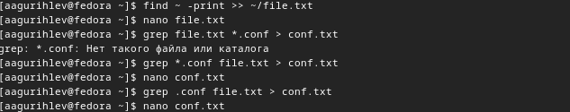{#fig:002 width=70%}

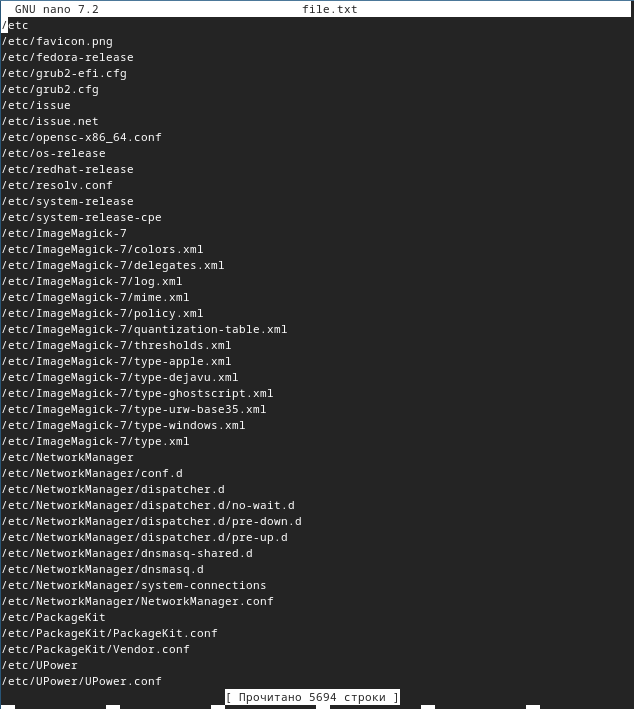{#fig:003 width=70%}

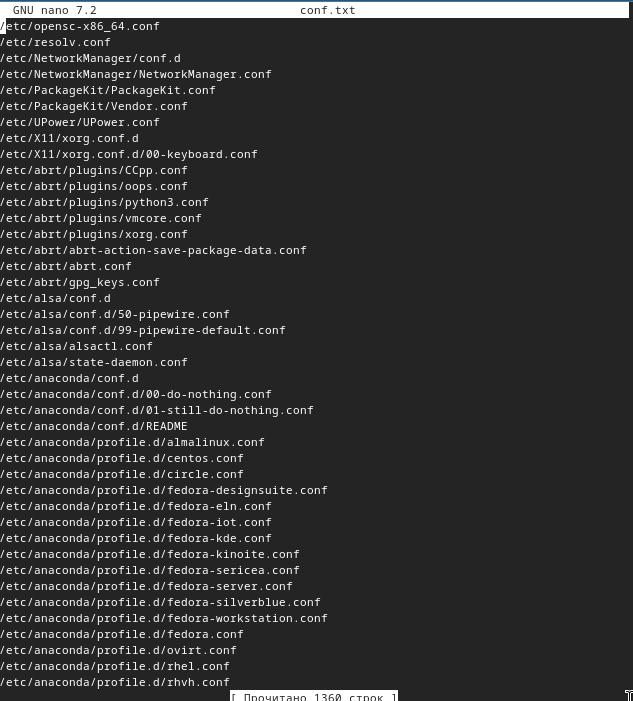{#fig:004 width=70%}

Чтобы определить, какие файлы в вашем домашнем каталоге имеют имена начинающиеся с символа c, используем команду find(рис. [-@fig:005]).

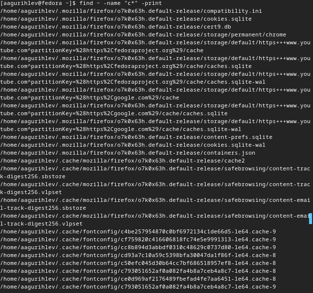{#fig:005 width=70%}

Выведем на экран имена файлов из каталога /etc, начинающиеся с символа h(рис. [-@fig:006]).

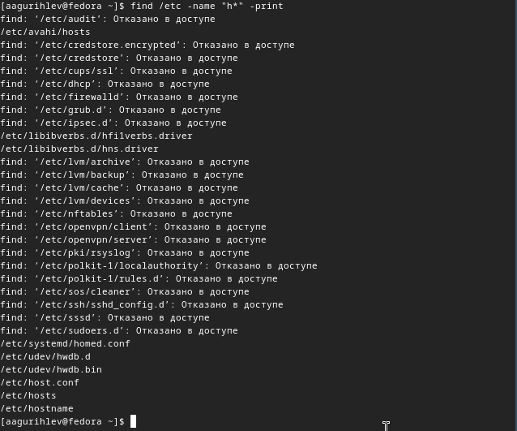{#fig:006 width=70%}

Запустите в фоновом режиме процесс и проверим его статус командой jobs(рис. [-@fig:007]).

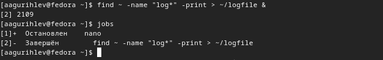{#fig:007 width=70%}

Проверим logfile, после чего удалим его с помощью rm(рис. [-@fig:008]).

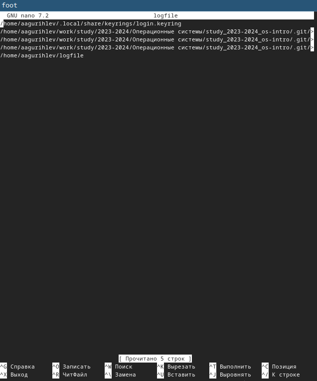{#fig:008 width=70%}

Запустим gedit в фоновом режиме, после чего проверим его идентификатор, используя ps aux и конвеер в grep(рис. [-@fig:009]).

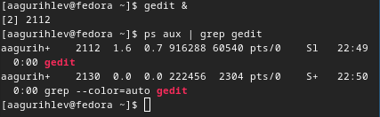{#fig:009 width=70%}

Завершим процесс gedit командой kill, и используем команду df(рис. [-@fig:010]).

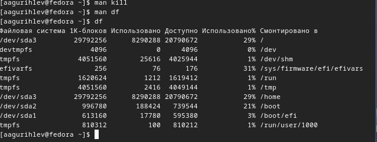{#fig:010 width=70%}

Просмотрев справку команды find, найдем только каталоги в домашнем каталоге(рис. [-@fig:011]):

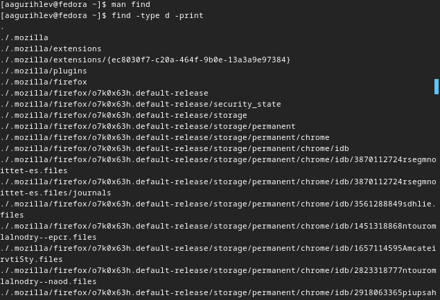{#fig:011 width=70%}

# Выводы

Проделав работу, я научился не только работать с командами поиска, но и перенаправлению вывода, конвееру и запуску процессов в фоновом режиме. Эти команды облегчают работу с файлами, а также позволяют создавать простые скрипты.

