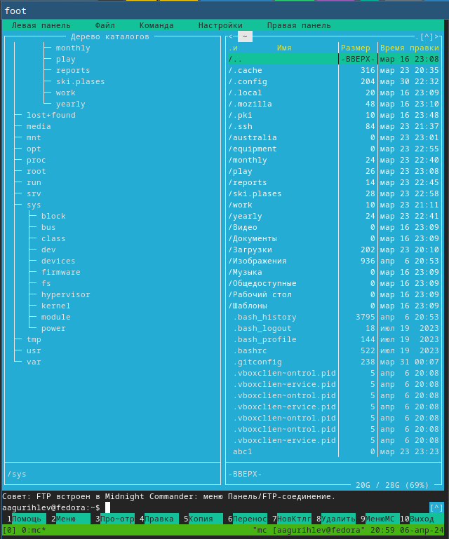
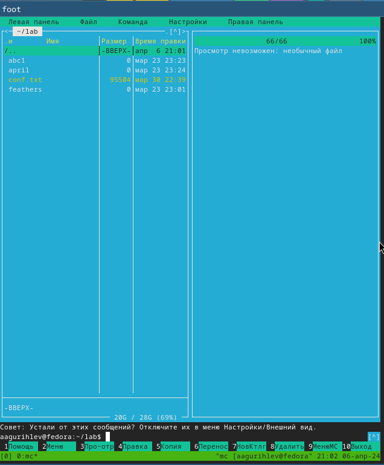
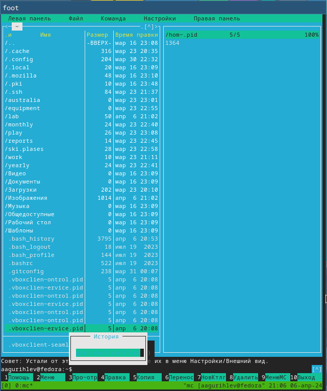
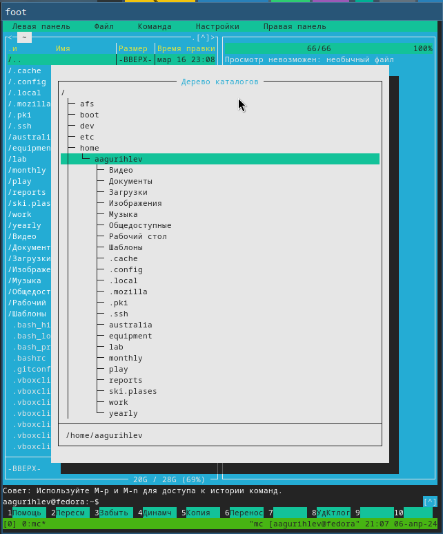
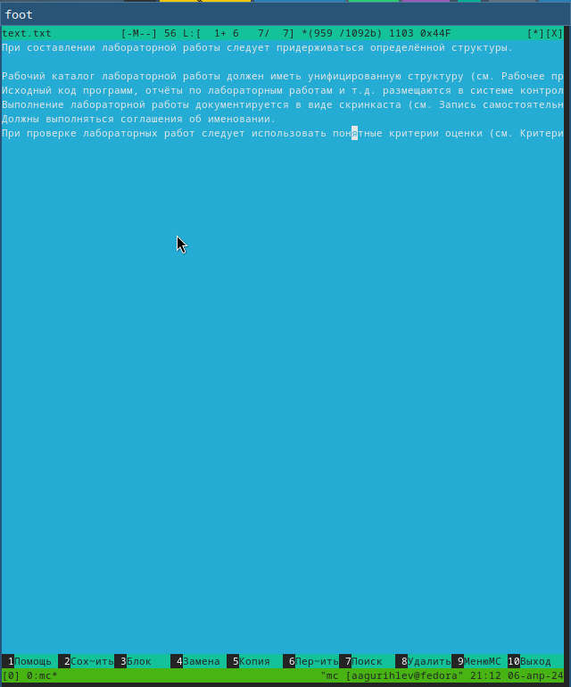
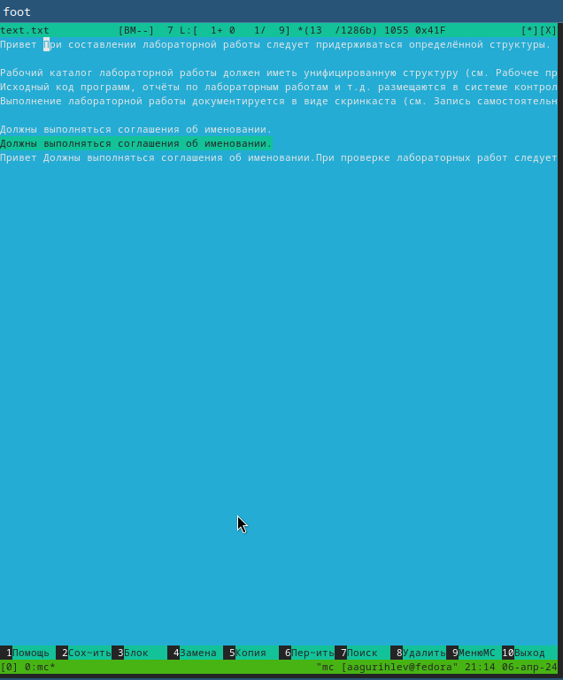
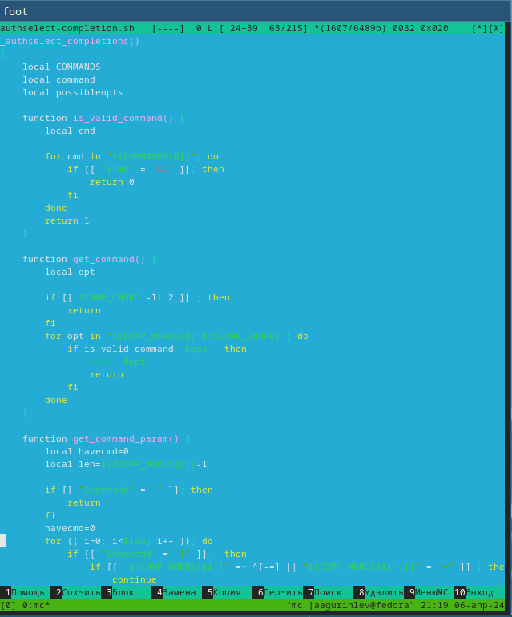

---
## Front matter
title: "Лабораторная работа №9"
subtitle: "Командная оболочка Midnight Commander"
author: "Гурылев Артем Андреевич"

## Generic otions
lang: ru-RU
toc-title: "Содержание"

## Bibliography
bibliography: bib/cite.bib
csl: pandoc/csl/gost-r-7-0-5-2008-numeric.csl

## Pdf output format
toc: true # Table of contents
toc-depth: 2
lof: true # List of figures
lot: true # List of tables
fontsize: 12pt
linestretch: 1.5
papersize: a4
documentclass: scrreprt
## I18n polyglossia
polyglossia-lang:
  name: russian
  options:
	- spelling=modern
	- babelshorthands=true
polyglossia-otherlangs:
  name: english
## I18n babel
babel-lang: russian
babel-otherlangs: english
## Fonts
mainfont: PT Serif
romanfont: PT Serif
sansfont: PT Sans
monofont: PT Mono
mainfontoptions: Ligatures=TeX
romanfontoptions: Ligatures=TeX
sansfontoptions: Ligatures=TeX,Scale=MatchLowercase
monofontoptions: Scale=MatchLowercase,Scale=0.9
## Biblatex
biblatex: true
biblio-style: "gost-numeric"
biblatexoptions:
  - parentracker=true
  - backend=biber
  - hyperref=auto
  - language=auto
  - autolang=other*
  - citestyle=gost-numeric
## Pandoc-crossref LaTeX customization
figureTitle: "Рис."
tableTitle: "Таблица"
listingTitle: "Листинг"
lofTitle: "Список иллюстраций"
lotTitle: "Список таблиц"
lolTitle: "Листинги"
## Misc options
indent: true
header-includes:
  - \usepackage{indentfirst}
  - \usepackage{float} # keep figures where there are in the text
  - \floatplacement{figure}{H} # keep figures where there are in the text
---

# Цель работы

Целью работы является освоение основных возможностей командной оболочки Midnight Commander, приобретение навыков практической работы по просмотру каталогов и файлов и манипуляций с ними.

# Выполнение лабораторной работы

Изучим информацию про команду mc с помощью man, после чего запустим его из командной строки.

С помощью управляющих клавиш можно управлять интерфейсом Midnight Commander и работать с файлами в нём. Например, Ctrl+U позволяет переставить панели местами, а зажатый Shift в просмотре файлов позволяет выделять их.

Исполним несколько основных команд левой и правой панели. На панелях возможно отображать список файлов, дерево каталогов, предпросмотр файла и инфомацию о нём(рис. [-@fig:001]).

{#fig:001 width=70%}

Далее рассмотрим подменю Файл, и выполним команды в нём. Это подменю содержит команды для работы с файлами, и в том числе с каталогами. Создадим каталог с помощью подменю, после чего скопируем в него файлы с помощью другой команды этого подменю(рис. [-@fig:002]).

{#fig:002 width=70%}

Подменю Команды содержит разнообразные команды Midnight Commander, и также предназначено для работы с командной строкой. Проведём с помощью подменю поиск файлов, выбор и выполнение предыдущей команды, переход в домашний каталог, используя дерево каталогов, и просмотр и правку файлов меню и расширений(рис. [-@fig:003], [-@fig:004]).

{#fig:003 width=70%}

{#fig:004 width=70%}

Создадим файл text.txt и используем встроенный редактор Midnight Commander. Скопируем в файл отрывок из Интернета(рис. [-@fig:005]).

{#fig:005 width=70%}

Проведём манипуляции с текстом, к примеру выделение фрагмента, перемещение и копирование его в разные части файла(рис. [-@fig:006]).

{#fig:006 width=70%}

Найдем файл с текстом на языке программирования, и продемонстрируем подсветку синтаксиса с помощью управляющих клавиш Ctrl+S(рис. [-@fig:007]).

{#fig:007 width=70%}

# Выводы

В этой лабораторной работе я научился работать с оболочкой Midnight Commander. Использование этой оболочки позволяет облегчить работу с файлами и файловой системой в Linux в целом. Кроме того, Midnight Commander способен обеспечить дополнительной полезной информацией.

# Контрольные вопросы

1. В mc существуют такие режимы работы, как Список файлов, Дерево, Быстрый просмотр и Информация.
2.
