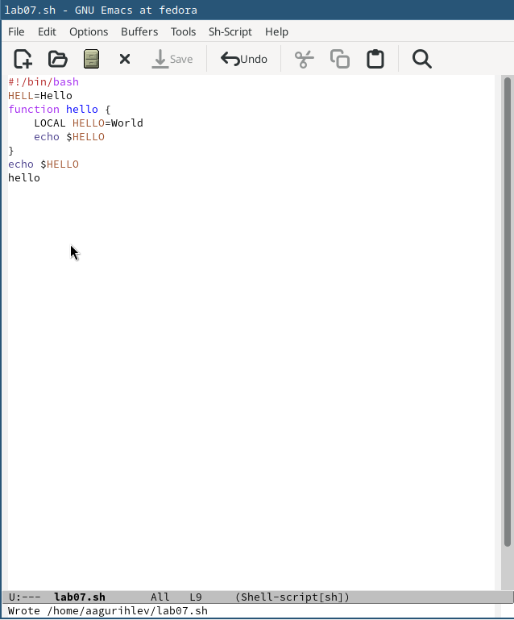
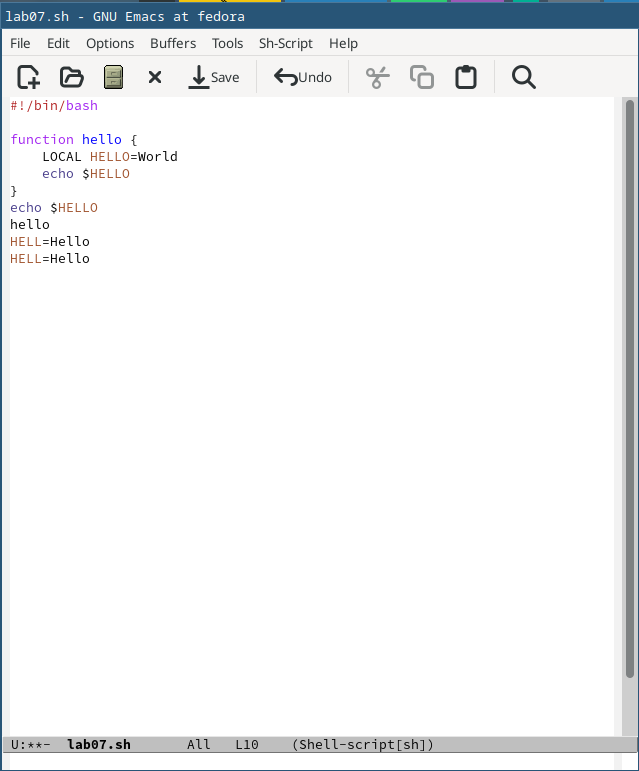
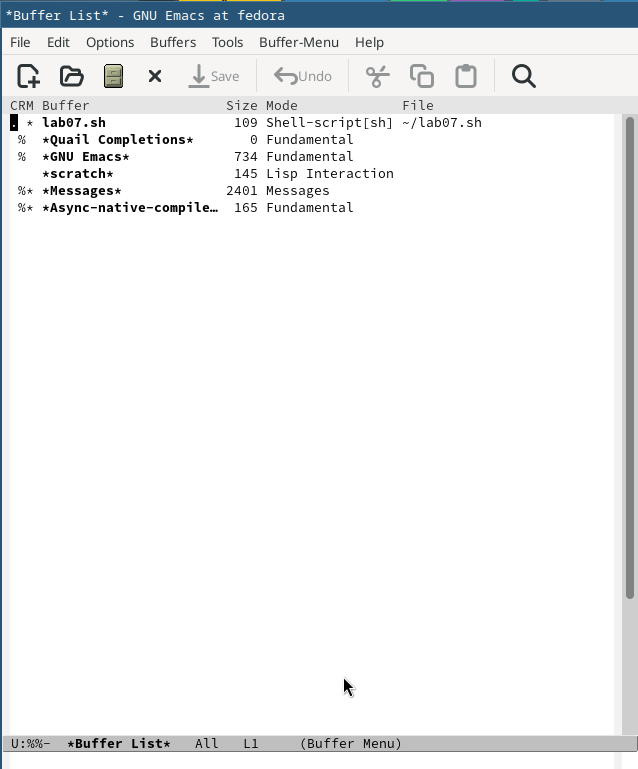
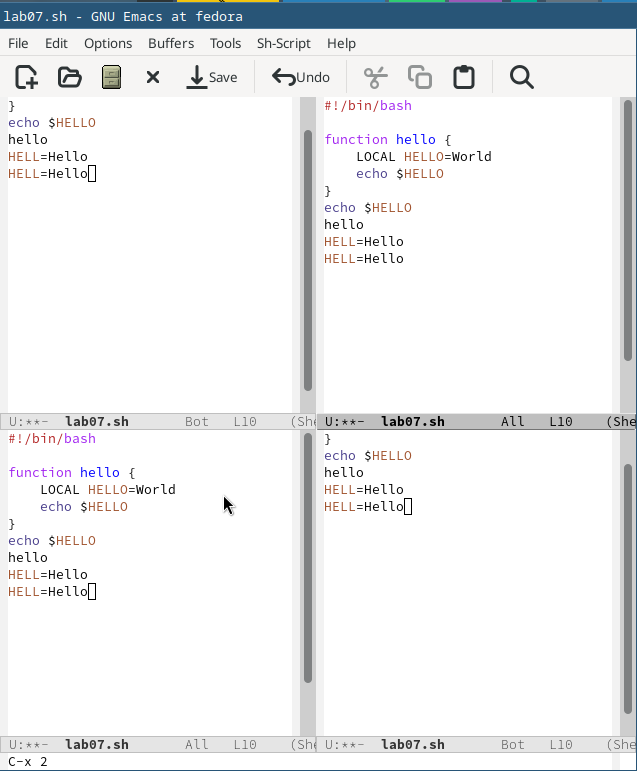
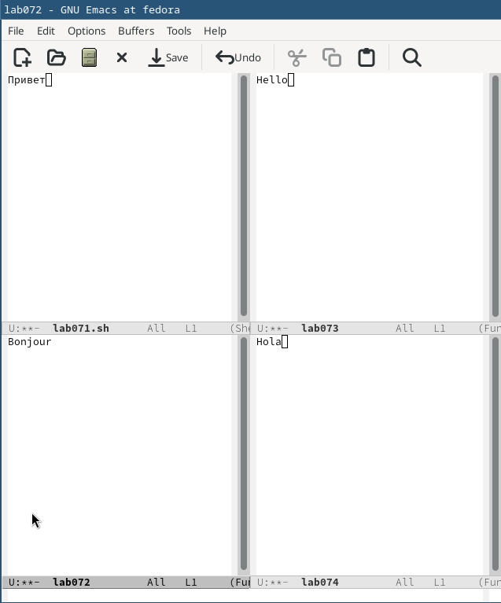
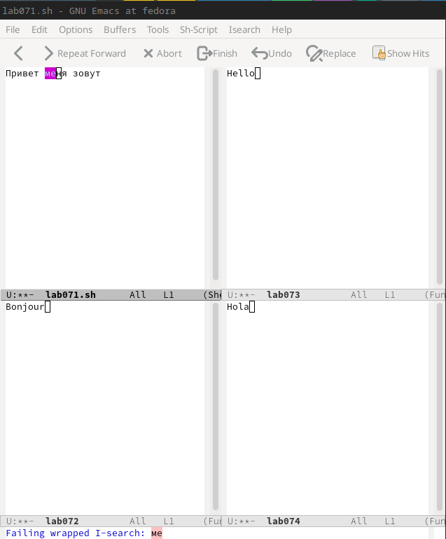
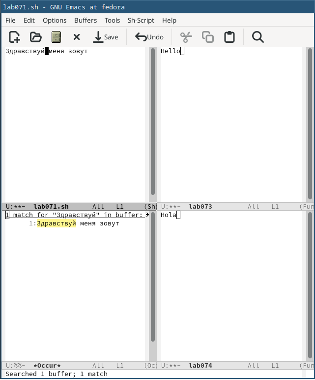

---
## Front matter
title: "Лабораторная работа №11"
subtitle: "Текстовой редактор emacs"
author: "Гурылев Артем Андреевич"

## Generic otions
lang: ru-RU
toc-title: "Содержание"

## Bibliography
bibliography: bib/cite.bib
csl: pandoc/csl/gost-r-7-0-5-2008-numeric.csl

## Pdf output format
toc: true # Table of contents
toc-depth: 2
lof: true # List of figures
lot: true # List of tables
fontsize: 12pt
linestretch: 1.5
papersize: a4
documentclass: scrreprt
## I18n polyglossia
polyglossia-lang:
  name: russian
  options:
	- spelling=modern
	- babelshorthands=true
polyglossia-otherlangs:
  name: english
## I18n babel
babel-lang: russian
babel-otherlangs: english
## Fonts
mainfont: PT Serif
romanfont: PT Serif
sansfont: PT Sans
monofont: PT Mono
mainfontoptions: Ligatures=TeX
romanfontoptions: Ligatures=TeX
sansfontoptions: Ligatures=TeX,Scale=MatchLowercase
monofontoptions: Scale=MatchLowercase,Scale=0.9
## Biblatex
biblatex: true
biblio-style: "gost-numeric"
biblatexoptions:
  - parentracker=true
  - backend=biber
  - hyperref=auto
  - language=auto
  - autolang=other*
  - citestyle=gost-numeric
## Pandoc-crossref LaTeX customization
figureTitle: "Рис."
tableTitle: "Таблица"
listingTitle: "Листинг"
lofTitle: "Список иллюстраций"
lotTitle: "Список таблиц"
lolTitle: "Листинги"
## Misc options
indent: true
header-includes:
  - \usepackage{indentfirst}
  - \usepackage{float} # keep figures where there are in the text
  - \floatplacement{figure}{H} # keep figures where there are in the text
---

# Цель работы

Целью данной лабораторной работы является ознакомление с операционной системой Linux и получение практических навыков работы с редактором Emacs.

# Выполнение лабораторной работы

Откроем emacs. С помощью комбинаций C-x и C-f создадим новый файл(или же буфер) lab07.sh. Наберём указанный текст(рис. [-@fig:001]).

{#fig:001 width=70%}

Используем комбинации клавиш для стандартных процедур редактирования(рис. [-@fig:002]).

{#fig:002 width=70%}

После перемещения курсора с помощью комбинаций клавиш перейдём к управлению буферами. Откроем список активных буферов, закроем предыдущее окно и перейдём к нему(рис. [-@fig:003]).

{#fig:003 width=70%}

Перейдём обратно в буфер lab07.sh и начнем управление окнами. С помощью комбинаций клавиш создадим четыре окна в нашем буфере(рис. [-@fig:004])

{#fig:004 width=70%}

В каждом окне откроем новый буфер с помощью C-x C-f, и напишем в каждом буфере строку(рис. [-@fig:005]).

{#fig:005 width=70%}

Перейдём к режиму поиска, откроем его и найдем нужное слово в строке(рис. [-@fig:006]).

{#fig:006 width=70%}

Используем режим поиска с заменой, чтобы заменить Привет на Здравствуйте. Теперь используем другой режим поиска, через M-s и о. Заметно, что этот режим использует регулярные выражение и ищет нужное слово во всех буферах(рис. [-@fig:007]).

{#fig:007 width=70%}

# Выводы

В данной лабораторной работе я научился работать с редактором emacs, создавать в нём файлы и их редактировать.

# Контрольные вопросы

1.
